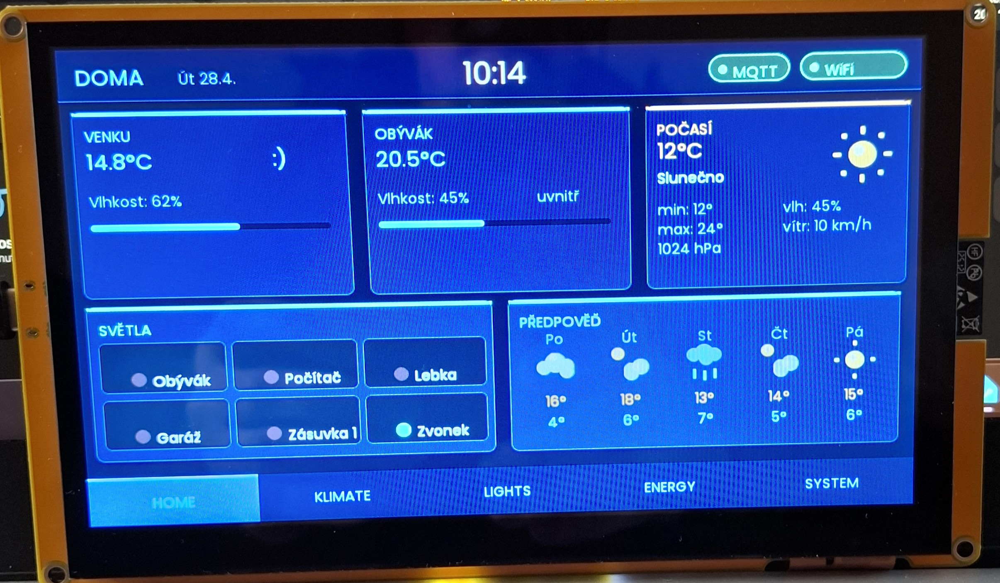
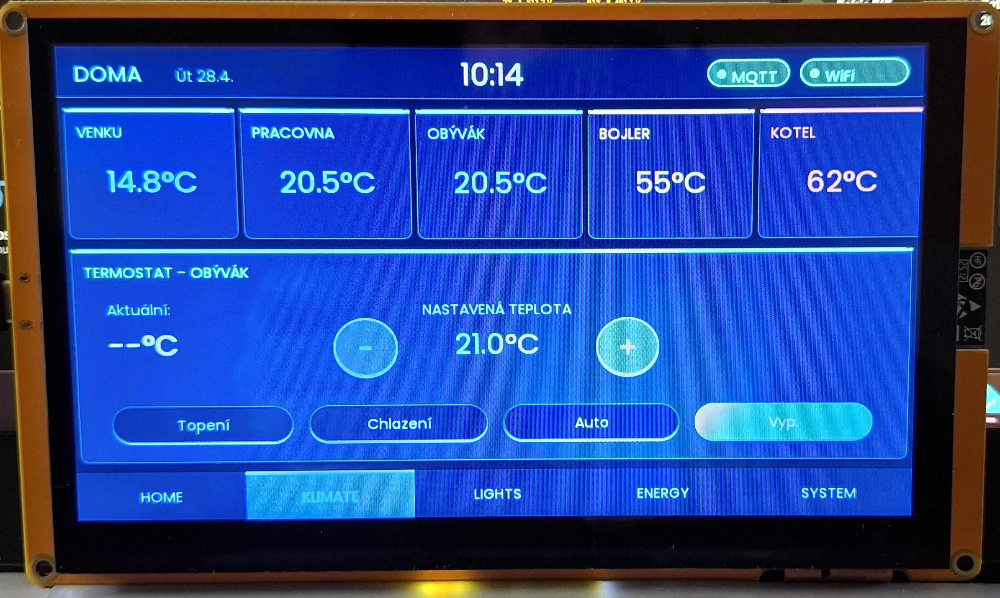
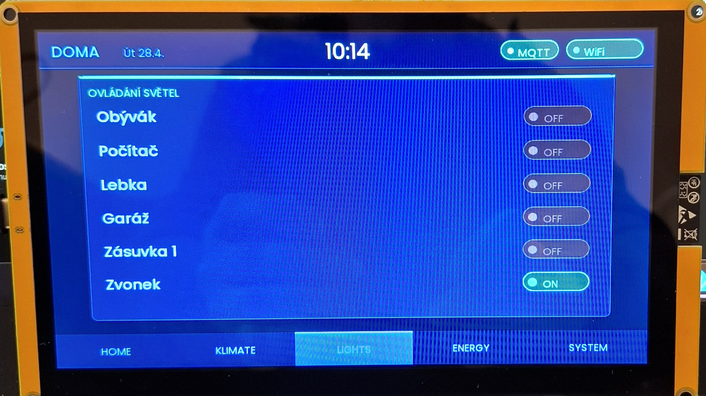
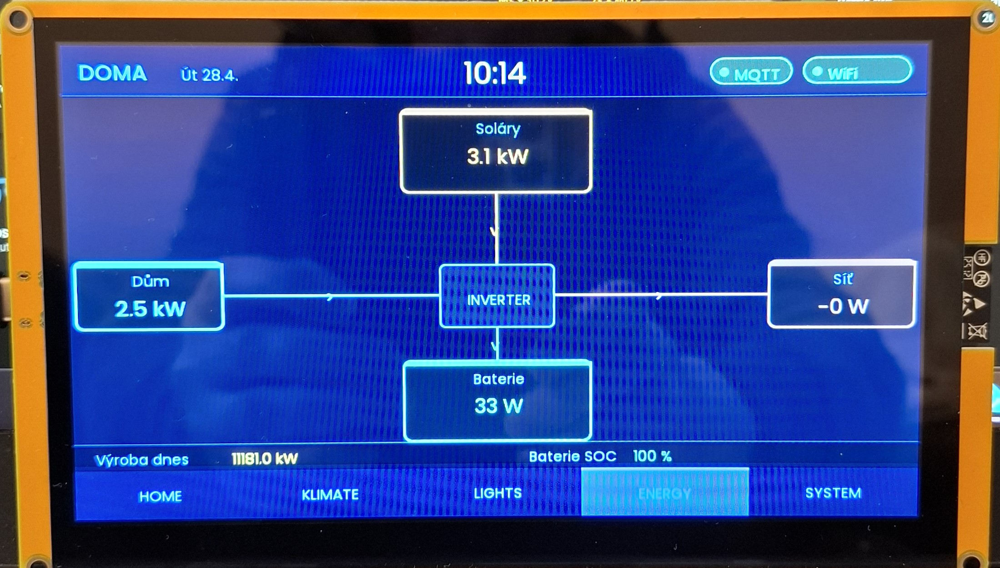
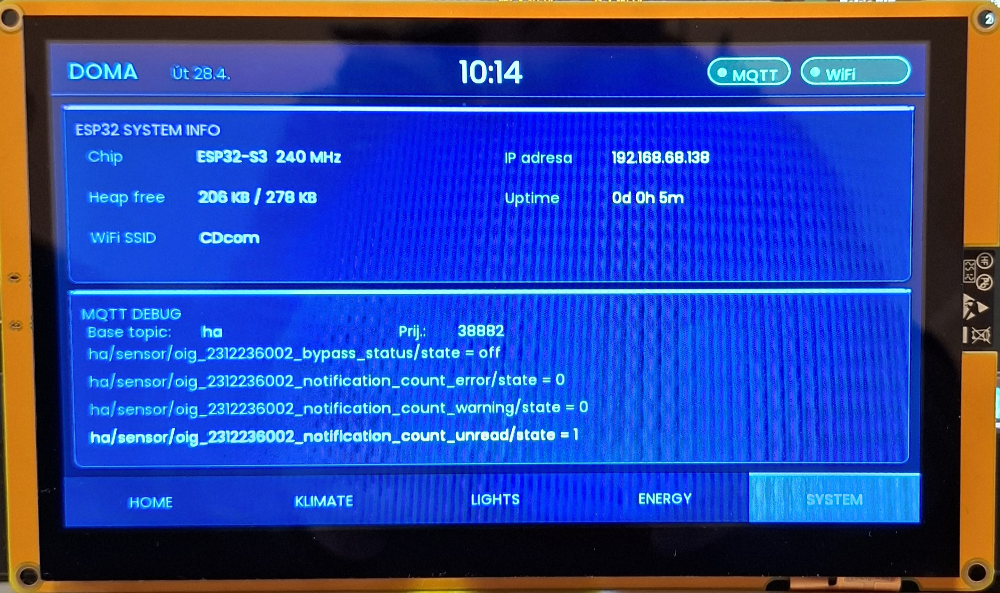
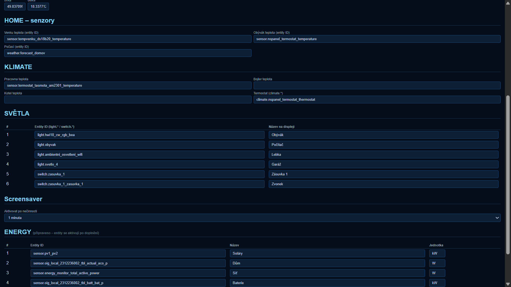

# ESP32 HA Dashboard

A 7-inch touchscreen dashboard for [Home Assistant](https://www.home-assistant.io/), built on the **ESP32-S3** (ESP32-8048S070C board) and powered by **LVGL 9.x**. Displays live sensor data, weather forecasts, light controls, energy monitoring, and thermostat control — all configured through a built-in web portal, no code changes required.



---

## ✨ Features

- **5 tabs** — HOME, KLIMATE, LIGHTS, ENERGY, SYSTEM
- **Live sensor data** via Home Assistant MQTT state stream
- **Current weather** (temperature, humidity, pressure, wind) from HA `weather.*` entity
- **5-day forecast** fetched from [Open-Meteo](https://open-meteo.com/) — free, no API key needed
- **Light control** (on/off toggle) via HA REST API — works with any `light.*` or `switch.*` entity
- **Thermostat control** — set target temperature and HVAC mode via HA REST API
- **Energy monitoring** — up to 6 power/energy sensors
- **Touchscreen UI** — capacitive touch (GT911), optimistic UI updates
- **WiFiManager** config portal — set WiFi, MQTT, HA URL/token, entity IDs from any browser
- **NTP time sync** — Prague timezone, automatic DST
- **System tab** — live MQTT debug, WiFi status, IP, heap usage, uptime

---

## 🖥️ Hardware

| Component | Details |
|-----------|---------|
| Board | [ESP32-8048S070C](https://www.aliexpress.com/item/-/1005006044871490.html) |
| Display | 7″ 800×480 RGB, IPS |
| Touch | Capacitive, GT911 controller |
| MCU | ESP32-S3, dual-core 240 MHz, 8 MB PSRAM |
| Flash | 16 MB |
| Optional sensor | DHT22 (temperature / humidity) |
| Power | USB-C or 5 V header |

---

## 📸 Screenshots

| HOME | KLIMATE | LIGHTS |
|------|---------|--------|
|  |  |  |

| ENERGY | SYSTEM | Config portal |
|--------|--------|---------------|
|  |  |  |

> **Tip:** Drop your own photos into the `docs/` folder and they will appear here automatically.

---

## 🛠️ Software & Dependencies

| Library | Version | Purpose |
|---------|---------|---------|
| [LVGL](https://lvgl.io/) | ^9.2.2 | UI framework |
| [TAMC_GT911](https://github.com/tamctec/gt911-arduino) | ^1.0.2 | Capacitive touch driver |
| [GFX Library for Arduino](https://github.com/moononournation/Arduino_GFX) | 1.5.0 | Display driver |
| [Adafruit NeoPixel](https://github.com/adafruit/Adafruit_NeoPixel) | ^1.12.0 | Status LED |
| [DHT sensor library](https://github.com/adafruit/DHT-sensor-library) | ^1.4.6 | Optional DHT22 sensor |
| [PubSubClient](https://github.com/knolleary/pubsubclient) | ^2.8 | MQTT client |
| [ArduinoJson](https://arduinojson.org/) | ^7.0.0 | JSON parsing |
| [WiFiManager](https://github.com/tzapu/WiFiManager) | ^2.0.17 | WiFi + config portal |

All dependencies are declared in `platformio.ini` and installed automatically by PlatformIO.

---

## 🚀 Installation

### 1. Prerequisites

- [VS Code](https://code.visualstudio.com/) + [PlatformIO IDE extension](https://platformio.org/install/ide?install=vscode)
- Or PlatformIO Core CLI: `pip install platformio`

### 2. Clone the repository

```bash
git clone https://github.com/Cdcomtom/HA-Dashboard.git
cd HA-Dashboard
```

### 3. Project structure

Place the source files so your project looks like this:

```
esp32-ha-dashboard/
├── platformio.ini
├── src/
│   ├── main.cpp
│   ├── screens.c
│   ├── screens.h
│   ├── display.h
│   ├── dashboard_data.h
│   ├── config_manager.h
│   ├── config_manager.cpp
│   ├── cfg_iface.h
│   ├── fonts_cz.h
│   └── images.h          (optional — weather icons)
└── docs/
    └── *.jpg             (screenshots)
```

### 4. Build & flash

```bash
# Build
pio run

# Flash (with board connected via USB)
pio run --target upload

# Monitor serial output
pio device monitor
```

Or use the PlatformIO sidebar in VS Code (Build / Upload / Monitor buttons).

---

## ⚙️ Configuration

### First boot — WiFi setup

1. On first boot (or after reset), the device creates a WiFi AP named **`HA-Dashboard`**
2. Connect to it from your phone or laptop
3. You will be redirected to the config portal — or open **http://192.168.4.1**
4. Enter your WiFi credentials and tap **Save**

### Config portal — full setup

After connecting to WiFi, the config portal is available at the device's IP address (shown on the SYSTEM tab or in serial monitor).

| Setting | Example | Description |
|---------|---------|-------------|
| MQTT Server | `192.168.1.10` | IP of your MQTT broker (e.g. Mosquitto on HA) |
| MQTT Port | `1883` | Default MQTT port |
| MQTT User / Pass | `ha_user` / `***` | Leave empty if no auth |
| MQTT Base Topic | `ha` | Prefix used in HA MQTT state stream |
| HA URL | `http://192.168.1.10:8123` | Home Assistant URL (HTTP recommended to save flash) |
| HA Token | `eyJ0...` | Long-Lived Access Token (see below) |
| Weather Lat/Lon | `50.0755` / `14.4378` | Your location for Open-Meteo forecast |
| Entity IDs | `sensor.venku_temp` | HA entity IDs for each sensor/light/thermostat |

### Generating a Long-Lived Access Token

1. In Home Assistant, go to your **Profile** (bottom-left avatar)
2. Scroll to **Long-Lived Access Tokens** → **Create Token**
3. Copy the token and paste it into the config portal

### MQTT topic format

The dashboard subscribes to `{base_topic}/#`. Home Assistant's MQTT integration publishes sensor states as:

```
ha/sensor/venku_temp/state          → "21.5"
ha/light/obyvak/state               → "on" / "off"
ha/weather/forecast_home/state      → "sunny"
ha/climate/termostat/attributes/current_temperature → "21.0"
```

Set **MQTT Base Topic** to match your HA configuration (usually `ha` or `homeassistant`).

---

## 🏠 Home Assistant Setup

### MQTT integration

Make sure the [MQTT integration](https://www.home-assistant.io/integrations/mqtt/) is enabled in HA and a broker (e.g. Mosquitto add-on) is running.

### Entities

The dashboard works with standard HA entity types:
- **Sensors** — `sensor.*` (temperature, humidity, pressure…)
- **Weather** — `weather.*`
- **Lights** — `light.*` or `switch.*`
- **Climate** — `climate.*` (thermostat)
- **Energy** — `sensor.*` with power/energy units

No custom HA components or automations are needed.

---

## 📁 Partition scheme

The firmware uses the `huge_app` partition scheme (3 MB app partition) due to the size of LVGL + all libraries. This is already configured in `platformio.ini`:

```ini
board_build.partitions = huge_app.csv
```

---

## 🔧 Customisation

| What | Where |
|------|-------|
| Number of lights / energy slots | `CFG_MAX_LIGHTS`, `CFG_MAX_ENERGY` in `config_manager.h` |
| Tab auto-return timeout | `AUTO_HOME_TIMEOUT_MS` in `screens.c` |
| Forecast refresh interval | `30UL * 60UL * 1000UL` in `main.cpp` loop |
| MQTT buffer size | `mqtt_client.setBufferSize(8192)` in `main.cpp` |
| NTP servers / timezone | `NTP_SERVER1/2`, `TZ_PRAGUE` in `main.cpp` |

---

## 🐛 Troubleshooting

| Symptom | Likely cause | Fix |
|---------|-------------|-----|
| Black screen after flash | Display or LVGL init failed | Check serial monitor — baud 115200 |
| Config portal not saving | Wrong URL in browser | Use http://`{device-ip}` not https |
| MQTT data not updating | Wrong base topic | Check SYSTEM tab → base topic matches HA |
| Lights not responding | Missing HA URL or token | Fill in HA REST API section in config portal |
| Forecast all zeros | Wrong lat/lon or no WiFi | Check coordinates, check serial log |
| Firmware too large | Added heavy library | Confirm `huge_app.csv` is in platformio.ini |

---

## 📄 License

MIT — see [LICENSE](LICENSE)

---

## 🇨🇿 Česky

### O projektu

ESP32 HA Dashboard je dotykový panel pro ovládání a monitoring chytré domácnosti přes Home Assistant. Zobrazuje živá data ze senzorů, předpověď počasí, umožňuje ovládání světel a termostatu — vše nastavitelné přes webový portál bez nutnosti měnit kód.

### Instalace

1. Naklonuj repozitář, otevři v PlatformIO (VS Code)
2. Připoj desku přes USB, spusť **Upload**
3. Při prvním startu se vytvoří AP hotspot `HA-Dashboard` — připoj se a nastav WiFi
4. Po připojení k WiFi otevři v prohlížeči `http://{IP-adresa-desky}` a nastav:
   - MQTT server (IP brokeru, port, přihlašovací údaje)
   - Base topic (shodný s nastavením HA MQTT integrace, obvykle `ha`)
   - HA URL + Long-Lived Access Token (vygeneruj v HA → Profil → Tokeny)
   - GPS souřadnice pro předpověď počasí
   - Entity ID všech senzorů, světel, termostatu

### Hardwarové požadavky

- Deska **ESP32-8048S070C** — ESP32-S3, 7" displej 800×480, kapacitní dotyk GT911
- Napájení přes USB-C nebo 5V header
- Volitelně DHT22 senzor pro lokální měření teploty/vlhkosti

### Podpora

Pokud narazíš na problém, otevři [issue](../../issues) nebo se podívej do sekce Troubleshooting výše.
